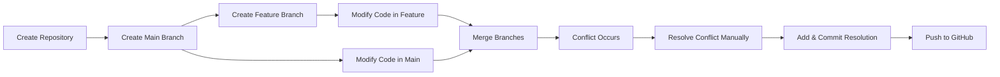

# Git Branching & Merge Conflict Resolution Practical

This repository demonstrates a complete hands-on practical exercise on **Git Branching, Merge Conflict Creation, Manual Resolution, and Remote Synchronization to GitHub**.

**Repository Link**: [https://github.com/Raghavendra-2007/Git-Branching-and-Merge-Conflict-Resolution](https://github.com/Raghavendra-2007/Git-Branching-and-Merge-Conflict-Resolution)

---

## 📋 Workflow Summary



---

## 🛠️ Step-by-Step Implementation

### Step 1: Create GitHub Repository
- **Repository Name**: `Git-Branching-and-Merge-Conflict-Resolution`
- **Visibility**: Public
- **URL**: `https://github.com/Raghavendra-2007/Git-Branching-and-Merge-Conflict-Resolution.git`

### Step 2: Initialize Local Repository
```powershell
git --version
git init -b main
git config user.name "Raghava m"
git config user.email "mylavarapu.kumar132049@marwadiuniversity.ac.in"
```

### Step 3: Create Initial Commit (main branch)
Created initial `index.html`:
```html
<!DOCTYPE html>
<html>
<head>
    <title>Git Branching Practical</title>
</head>
<body>
    <h1>Welcome to Main Branch</h1>
    <p>This page is created in the main branch.</p>
</body>
</html>
```
Commands:
```powershell
git add index.html
git commit -m "Initial commit with index page"
```

### Step 4: Create and Switch to Feature Branch
```powershell
git checkout -b feature
git branch
```

### Step 5: Modify in Feature Branch
Updated `index.html`:
```html
<!DOCTYPE html>
<html>
<head>
    <title>Git Branching Practical</title>
</head>
<body>
    <h1>Welcome to Feature Branch</h1>
    <p>This page is updated in the feature branch.</p>
</body>
</html>
```
Commands:
```powershell
git add index.html
git commit -m "Update index page in feature branch"
```

### Step 6: Switch Back to Main & Make Conflicting Change
Switched back to `main`:
```powershell
git checkout main
```
Updated `index.html` on the exact same lines:
```html
<!DOCTYPE html>
<html>
<head>
    <title>Git Branching Practical</title>
</head>
<body>
    <h1>Welcome to Main Website</h1>
    <p>This page is updated in the main branch.</p>
</body>
</html>
```
Commands:
```powershell
git add index.html
git commit -m "Update index page in main branch"
```

### Step 7 & 8: Merge Feature into Main (Merge Conflict)
```powershell
git merge feature
```
Terminal output:
```text
Auto-merging index.html
CONFLICT (content): Merge conflict in index.html
Automatic merge failed; fix conflicts and then commit the result.
```

### Step 9: Inspect Conflict Markers
Git flagged conflicting lines inside `index.html`:
```html
<!DOCTYPE html>
<html>
<head>
    <title>Git Branching Practical</title>
</head>
<body>
<<<<<<< HEAD
    <h1>Welcome to Main Website</h1>
    <p>This page is updated in the main branch.</p>
=======
    <h1>Welcome to Feature Branch</h1>
    <p>This page is updated in the feature branch.</p>
>>>>>>> feature
</body>
</html>
```

### Step 10: Resolve the Conflict Manually
Combined the desired updates into a unified version:
```html
<!DOCTYPE html>
<html>
<head>
    <title>Git Branching Practical</title>
</head>
<body>
    <h1>Welcome to Main Website - Feature Update</h1>
    <p>This page contains updates from both main and feature branches.</p>
</body>
</html>
```
Commands:
```powershell
git add index.html
git commit -m "Resolve merge conflict between main and feature"
```

### Step 11: Verify Commit History Graph
```powershell
git log --oneline --graph --all
```
Output:
```text
*   971f733 (HEAD -> main) Resolve merge conflict between main and feature
|\  
| * 452eb12 (feature) Update index page in feature branch
* | a1a2f4b Update index page in main branch
|/  
* aee5835 Initial commit with index page
```

### Step 12: Connect to GitHub & Push Both Branches
```powershell
git remote add origin https://github.com/Raghavendra-2007/Git-Branching-and-Merge-Conflict-Resolution.git
git push -u origin main
git push -u origin feature
```

---

## 📄 Final File (`index.html`)

```html
<!DOCTYPE html>
<html>
<head>
    <title>Git Branching Practical</title>
</head>
<body>
    <h1>Welcome to Main Website - Feature Update</h1>
    <p>This page contains updates from both main and feature branches.</p>
</body>
</html>
```

---

## 📝 Short Explanation

A Git repository was created with two branches: **main** and **feature**. An `index.html` file was added and committed to the main branch. The feature branch was created from main and the same file was modified differently in both branches. 

When the feature branch was merged into main, Git detected conflicting changes in the same lines of the file and generated a merge conflict. The conflict was resolved manually by editing the file and combining the required changes. The resolved file was added and committed. Finally, both branches were pushed to GitHub and the commit history was verified using `git log --oneline --graph --all`.

---

## ✅ Status
- **Main Branch**: Synced to GitHub with resolved merge commit
- **Feature Branch**: Synced to GitHub
- **Status**: Completed Successfully ✔
